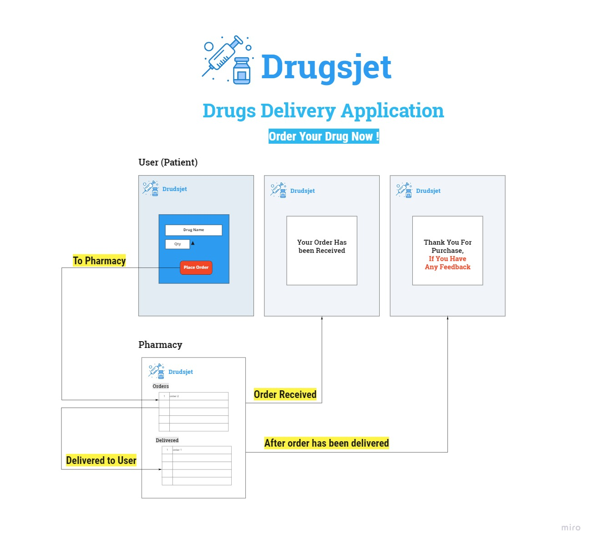
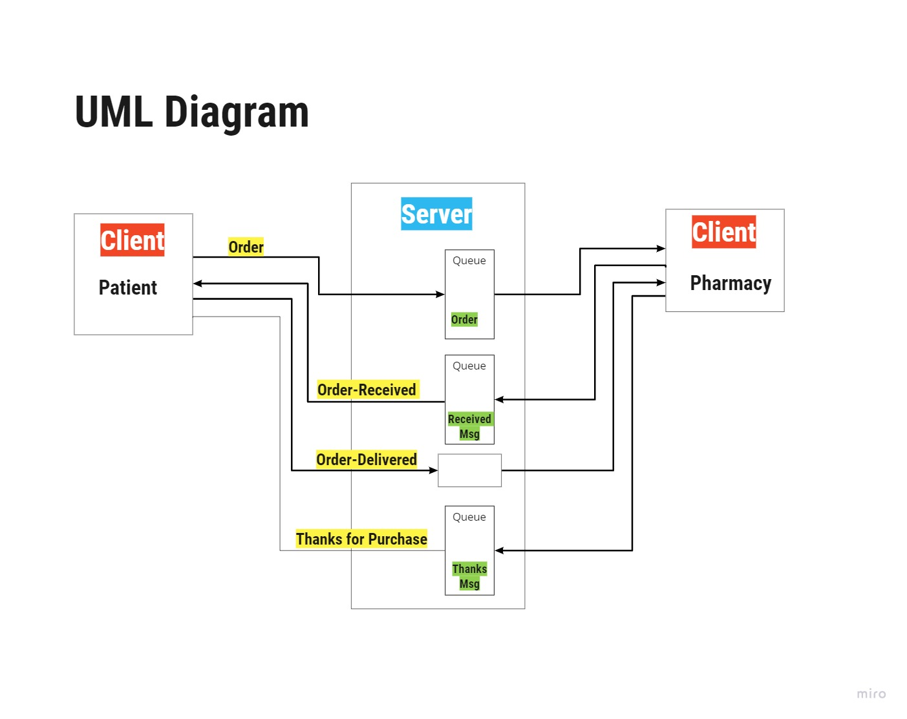

# Drugsjet

## Medicines Delivery Application
Application for users (patients) to order medicines and other things from the pharmacy. The user can place an order and will receive a notification if their request is available or not. On the other hand, the pharmacy will receive the order and send it to the user. After the package has been delivered, the pharmacy will send a thank you note to the user and if they have any feedback.

## Application Wireframe 

## UML 

